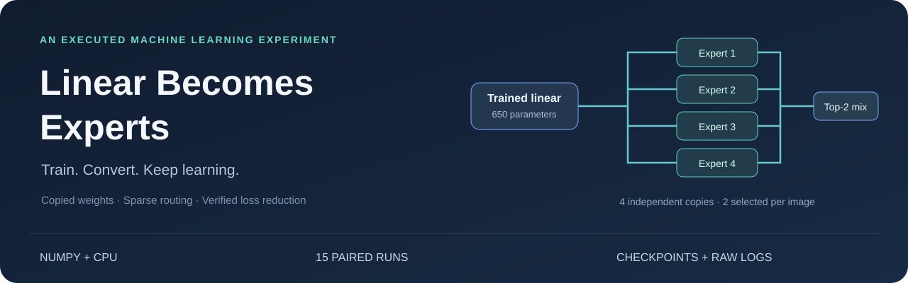

<p align="center"></p>

# Linear Becomes Experts

**Train a literal linear model. Upcycle its learned weights into a sparse MoE. Measure continued learning.**

[](https://colab.research.google.com/github/JoeIndyGit/14-Linear-to-MoE/blob/main/linear_to_moe.ipynb)
[](https://github.com/JoeIndyGit/14-Linear-to-MoE/actions/workflows/verify.yml)

[Executed notebook](linear_to_moe.ipynb) · [Full report](docs/EXPERIMENT.md) · [Reproducibility guide](docs/REPRODUCIBILITY.md) · [Raw comparisons](results/comparison.csv)

## The measured result

A **650-parameter affine classifier** learns handwritten digits. Its trained
weights become **four independent experts**, with **two selected per image**.
Conversion preserves predictions to floating-point precision. Continued
training reduces both train and validation loss in **all 15 cases** across
**5 initialization seeds and 3 stratified splits**.

| Stage | Train CE ↓ | Validation CE ↓ |
|---|---:|---:|
| Random linear | 2.304150 ± 0.005512 | 2.304000 ± 0.005555 |
| Trained linear / conversion point | 0.172481 ± 0.008430 | 0.222265 ± 0.026439 |
| Linear continuation | 0.045585 ± 0.005137 | 0.131822 ± 0.024428 |
| Upcycled MoE | 0.012547 ± 0.001818 | 0.099832 ± 0.026355 |

Mean ± sample SD; cross-entropy in nats. After conversion, mean training loss
falls **92.73%** and validation loss falls **55.08%**. Final mean MoE test
accuracy is **97.28%**. This is a small digit-classification
experiment with descriptive variation across overlapping splits.


## Baseline comparisons

| Final branch | Total epochs | Train CE | Validation CE | Test CE | Test accuracy |
|---|---:|---:|---:|---:|---:|
| Linear continuation | 100 | 0.045585 ± 0.005137 | 0.131822 ± 0.024428 | 0.132057 ± 0.022655 | 96.52 ± 0.42% |
| Upcycled MoE | 100 | 0.012547 ± 0.001818 | 0.099832 ± 0.026355 | 0.100430 ± 0.031269 | 97.28 ± 0.62% |
| Linear · projection budget | 212 | 0.020180 ± 0.003268 | 0.126776 ± 0.032758 | 0.131882 ± 0.033453 | 96.80 ± 0.66% |
| MoE from scratch | 100 | 0.012231 ± 0.002989 | 0.124414 ± 0.034075 | 0.101841 ± 0.030474 | 97.15 ± 0.95% |
| Upcycled MoE · no balance | 100 | 0.013519 ± 0.002360 | 0.099341 ± 0.031299 | 0.101469 ± 0.030571 | 97.31 ± 0.55% |

Every run includes equal-step linear continuation, a linear control with the
same cumulative **forward projection MAC budget**, an independently initialized
MoE trained from scratch, and an upcycled MoE without balancing.
The projection budget includes pretraining but excludes backward, optimizer,
sorting, softmax and mixing; it is not a full FLOP or wall-clock match.

The upcycled MoE has lower validation CE than the equal-step linear control
in **15/15** cases. Accuracy gains vary by seed and split;
balancing does not consistently improve held-out results. The [full report](docs/EXPERIMENT.md)
includes every paired delta, split mean, budget and unfavorable ablation result.


## Run and verify

Use **Python 3.12** from the repository root:

```bash
python -m venv .venv
source .venv/bin/activate
python -m pip install -r requirements-dev.txt
python check_submission.py --reproduce --check-singleton --execute-notebook
```

Windows activation: `.venv\Scripts\activate`.
For a separate experiment, preserving the submitted evidence:

```bash
python train.py --out runs/my-experiment
python -c "from plots import plot_results; plot_results('runs/my-experiment')"
```

For a quick single-seed/single-split run:

```bash
python train.py --out runs/quick --seeds 42 --split-seeds 2026
```

The standalone notebook embeds all code. Open in Colab/Jupyter and **Run all**.
Saved notebook outputs were executed by **a fresh Jupyter kernel**, not an
emulated executor. It also reloads a final checkpoint and trains ten more epochs.
No GPU, API key or dataset download is needed once dependencies are installed.

Verification independently checks checkpoint metrics, exact data splits, raw
CSV endpoints, aggregates, conversion, sparse dispatch, finite-difference
gradients, expert participation and exact model/Adam/RNG resumption. Fresh runs
use explicit floating-point tolerances (`rtol=1e-6`, `atol=1e-8`) and exclude
runtime metrics. Singleton plots are checked for numerical warnings.
GitHub Actions executes this verification on pushes and pull requests.

## Why conversion preserves predictions

The starting model has **no hidden layer**: $z(x)=xW+b$. Each expert receives
an independent copy of $W,b$, and normalized top-2 gates mix its logits:

$$z_{MoE}(x)=\sum_{e\in S(x)}g_e(x)(xW_e+b_e),\quad \sum_{e\in S(x)}g_e(x)=1.$$

Initially all expert logits agree, so the mixture equals the trained linear
model. Maximum measured conversion error: **4.441e-15**.
Different assignments produce different expert updates. The task router
gradient starts at zero, then appears as experts diverge. The balancing term
can train the router from the start. Hard selection itself is not differentiated.

| Model | Total parameters | Parameter entries used per image | Projection MACs per image |
|---|---:|---:|---:|
| Linear | 650 | 650 | 640 |
| Four-expert top-2 MoE | 2,860 | 1,560 | 1,536 |

Only selected experts process an image; no inputs are dropped. Parameter
counts are capacity counts and do not establish inference speed.

## Training protocol

| Setting | Value |
|---|---|
| Dataset | 1,797 digits, 8×8 pixels, ten classes; `X / 16` |
| Each stratified split | 1,078 train / 359 validation / 360 test |
| Split seeds | 2026, 2027, 2028 |
| Initialization seeds | 42, 43, 44, 45, 46 |
| Pretraining / continuation | 20 / 80 epochs |
| Batch size / optimizer | 64 / handwritten Adam |
| Adam β₁, β₂, ε | 0.9, 0.999, 1e−8; no weight decay |
| Learning rates | 0.01 pretraining, 0.005 continuation, 0.002 router |
| Balancing coefficient | 0.01 (zero in ablation) |
| Experts / selected | 4 / 2 |
| Device / precision | CPU / float64 / one BLAS thread |
| Reporting | Fixed final epoch in each branch, no early stopping |

All continuation branches reset Adam. Identical seeds generate corresponding
minibatch schedules. Scaling uses a known pixel bound and no fitted transform.
Final epochs are fixed; no best-seed, best-checkpoint or test-driven tuning.

## Inspect the experts

All experts receive assignments and change weights. The router learns too.
The report includes validation class×expert heatmaps, normalized routing
entropy, gradient probes and the balancing ablation. Expert identities remain
local to each run, and routing patterns are not treated as semantic labels.


## Repository guide

| File | Purpose |
|---|---|
| [linear_to_moe.ipynb](linear_to_moe.ipynb) | Standalone notebook with real Jupyter outputs and five plots |
| [train.py](train.py) | Affine models, sparse routing, gradients, Adam, five-branch experiments |
| [verify.py](verify.py) | Numerical gradients, dispatch, independent storage, exact resumption |
| [check_submission.py](check_submission.py) | Saved-evidence audit, script reproduction and clean notebook execution |
| [evidence.py](evidence.py) | Float-tolerant comparisons with strict structure and identifiers |
| [plots.py](plots.py) | Dynamic plots; one-seed runs supported |
| [build_artifacts.py](build_artifacts.py) | Fresh-kernel notebook execution and measured documentation |
| [results/](results/) | Logs, per-epoch CSVs, all checkpoints, split indices and routing diagnostics |
| [docs/EXPERIMENT.md](docs/EXPERIMENT.md) | Method, all cases, paired comparisons, budgets and limitations |
| [docs/REPRODUCIBILITY.md](docs/REPRODUCIBILITY.md) | Reproduction commands and saved-result navigation |
| [.github/workflows/verify.yml](.github/workflows/verify.yml) | Automated full verification |
| [MANIFEST.sha256](MANIFEST.sha256) | Submission file checksums |

## Scope and attribution

This demonstrates affine-model upcycling and continued learning on one small
real dataset. It does not establish language-model scaling, inference speedup
or universal MoE superiority. More datasets and a capacity-matched nonlinear
dense control would broaden the experimental evidence.

References: [digits](https://scikit-learn.org/stable/modules/generated/sklearn.datasets.load_digits.html),
[Sparse Upcycling](https://arxiv.org/abs/2212.05055),
[Switch Transformers](https://arxiv.org/abs/2101.03961).
This is an independent educational experiment. AI assistance was used to
develop and document it; results come from executed training and verification.
