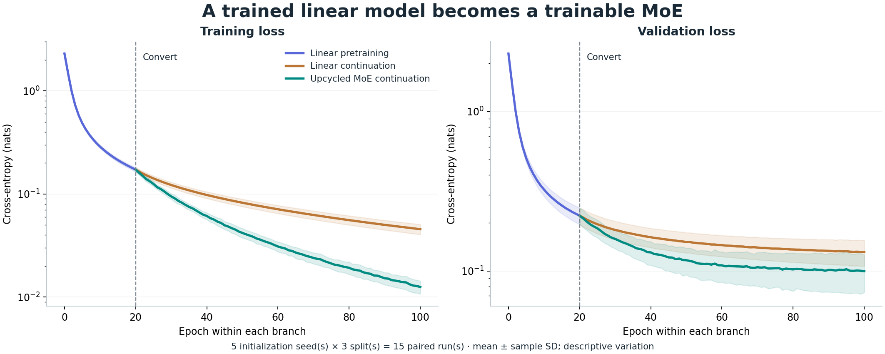
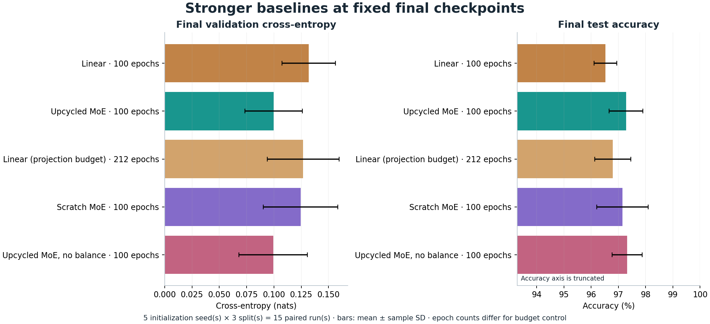
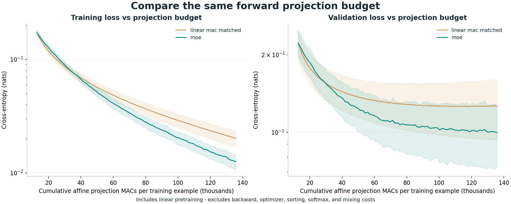
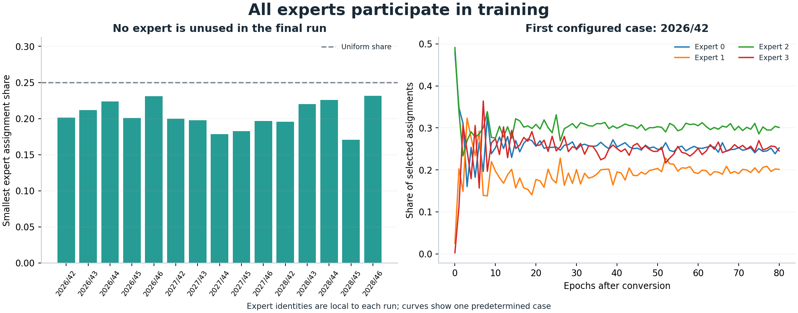
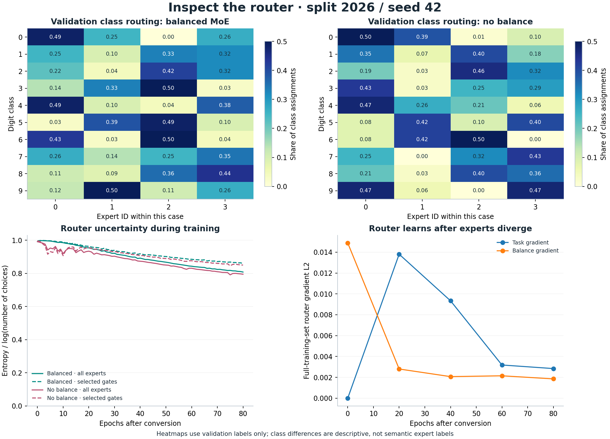

# Experiment report

The assignment asks for a trained linear model, conversion into an MoE, and
proof of continued loss reduction. **All 15 paired cases pass all three stages**:
linear pretraining reduces loss, conversion preserves predictions, and MoE
continuation reduces both training and validation loss.

## Protocol

| Setting | Value |
|---|---|
| Dataset | 1,797 digits, 8×8 pixels, ten classes; `X / 16` |
| Each stratified split | 1,078 train / 359 validation / 360 test |
| Split seeds | 2026, 2027, 2028 |
| Initialization seeds | 42, 43, 44, 45, 46 |
| Pretraining / continuation | 20 / 80 epochs |
| Batch size / optimizer | 64 / handwritten Adam |
| Adam β₁, β₂, ε | 0.9, 0.999, 1e−8; no weight decay |
| Learning rates | 0.01 pretraining, 0.005 continuation, 0.002 router |
| Balancing coefficient | 0.01 (zero in ablation) |
| Experts / selected | 4 / 2 |
| Device / precision | CPU / float64 / one BLAS thread |
| Reporting | Fixed final epoch in each branch, no early stopping |

All compared continuation branches start with reset Adam moments and the same
shuffle seed. The scratch MoE has independent random experts and receives the
same 20 + 80 epoch schedule, including its Adam reset.
No learning rate or stopping rule was selected using the new test results.
The three new split definitions and all seeds were chosen before this expanded
suite. The earlier assignment used split 2026 and seeds 42–44; this expansion
is an audit extension, not a claim of wholly unseen experimental design.
Test labels are evaluated only at fixed-final checkpoints. Conversion checks
use all images without labels; router heatmaps use validation labels.

## Models and conversion

The literal linear classifier is $z=xW+b$, followed by a softmax for
classification. The MoE router computes $s=xR+r$, chooses a top-k set $S(x)$,
and uses $g_e=\exp(s_e)/\sum_{j\in S(x)}\exp(s_j)$ to mix selected expert logits.
No hidden layer is added to any expert.

At conversion $W_e=W$ and $b_e=b$, so normalized gates preserve the trained
logits. Each copy owns independent storage. Expert dispatch computes each
expert only on assigned rows; no capacity cap or dropped sample is used.

The task objective is ordinary mean cross-entropy. The training objective adds
$\alpha E\sum_e f_e P_e$, where $f_e$ is the fraction of top-k assignments
and $P_e$ is the mean full-router softmax probability. Assignment fractions
are stop-gradient, and gradients flow through full-router probabilities for
this auxiliary term. This adapts the Switch-style balancing form to top-k
assignment counts; it is not an implementation of Switch Transformer.

Task gradients flow through selected softmax weights within a fixed top-k
set. There is no derivative through the hard selection. At identical experts,
the task router gradient is zero to numerical precision; assignment-dependent
expert updates break symmetry. The balancing gradient can act from the start.
Finite differences test both task and combined objectives away from ties.

| Model | Stored parameters | Parameter entries used per image | Projection MACs per image |
|---|---:|---:|---:|
| Linear | 650 | 650 | 640 |
| MoE | 2860 | 1560 | 1536 |

Maximum conversion logit difference: **4.441e-15** across all cases and inputs.
Parameter entries are capacity counts, not FLOPs or a speed measurement.

## Continued learning

| Stage | Train CE ↓ | Validation CE ↓ |
|---|---:|---:|
| Random linear | 2.304150 ± 0.005512 | 2.304000 ± 0.005555 |
| Trained linear / conversion point | 0.172481 ± 0.008430 | 0.222265 ± 0.026439 |
| Linear continuation | 0.045585 ± 0.005137 | 0.131822 ± 0.024428 |
| Upcycled MoE | 0.012547 ± 0.001818 | 0.099832 ± 0.026355 |

Mean ± sample SD over 15 cases. CE is in nats and excludes balancing.
From conversion to the final MoE, mean train CE falls **92.73%** and
mean validation CE falls **55.08%**. These are endpoint reductions;
individual epoch curves can fluctuate.



## Baselines and ablation

| Final branch | Total epochs | Train CE | Validation CE | Test CE | Test accuracy |
|---|---:|---:|---:|---:|---:|
| Linear continuation | 100 | 0.045585 ± 0.005137 | 0.131822 ± 0.024428 | 0.132057 ± 0.022655 | 96.52 ± 0.42% |
| Upcycled MoE | 100 | 0.012547 ± 0.001818 | 0.099832 ± 0.026355 | 0.100430 ± 0.031269 | 97.28 ± 0.62% |
| Linear · projection budget | 212 | 0.020180 ± 0.003268 | 0.126776 ± 0.032758 | 0.131882 ± 0.033453 | 96.80 ± 0.66% |
| MoE from scratch | 100 | 0.012231 ± 0.002989 | 0.124414 ± 0.034075 | 0.101841 ± 0.030474 | 97.15 ± 0.95% |
| Upcycled MoE · no balance | 100 | 0.013519 ± 0.002360 | 0.099341 ± 0.031299 | 0.101469 ± 0.030571 | 97.31 ± 0.55% |

| Baseline | Mean paired Δ validation CE | MoE lower validation CE | Mean paired Δ test accuracy (pp) | MoE better / tie / worse accuracy |
|---|---:|---:|---:|---:|
| Linear continuation | -0.031990 ± 0.015574 | 15/15 | 0.759 ± 0.731 | 13 / 1 / 1 |
| Linear · projection budget | -0.026944 ± 0.017157 | 13/15 | 0.481 ± 0.816 | 11 / 1 / 3 |
| MoE from scratch | -0.024582 ± 0.028355 | 13/15 | 0.130 ± 1.044 | 7 / 1 / 7 |
| Upcycled MoE · no balance | 0.000491 ± 0.016248 | 8/15 | -0.037 ± 0.711 | 6 / 1 / 8 |

Paired deltas are MoE minus baseline within the same seed and split. Negative
CE deltas favor MoE; positive accuracy deltas favor MoE. The MoE's accuracy
advantage varies. Removing balancing gives slightly better aggregate validation
CE and test accuracy here; balancing is not established as necessary for this
small dataset. The scratch MoE reaches a similar aggregate train loss, while
its validation CE is higher on average. These are observations from this suite,
not general claims about sparse upcycling.



### Variation across data splits

| Split seed | Linear validation CE | Upcycled MoE | Budget linear | Scratch MoE | No balance |
|---|---:|---:|---:|---:|---:|
| 2026 | 0.133301 | 0.089005 | 0.124821 | 0.136592 | 0.095453 |
| 2027 | 0.159918 | 0.131410 | 0.166467 | 0.145816 | 0.135224 |
| 2028 | 0.102248 | 0.079082 | 0.089040 | 0.090834 | 0.067348 |

Each row averages 5 initialization seeds. The splits reuse images,
so their 15 case metrics are correlated. SD describes variation; we do not
report an iid standard error, confidence interval or significance test.

### Forward projection budget

For input dimension $d$, classes $C$, experts $E$ and selected experts $k$,
linear projections cost $dC$ MACs per image and MoE projections cost
$dE+kdC$. Biases, sorting, softmax, mixing, backward and optimizer work are
excluded. Both budgets include the shared linear pretraining. The linear budget
control runs **192 continuation epochs**, versus
80 for the MoE, so default cumulative projection costs match exactly.
For custom sizes the linear epoch budget rounds up and records the excess.

| Branch | Cumulative forward projection MACs | Relative to upcycled MoE |
|---|---:|---:|
| Linear continuation | 68,992,000 | 0.472× |
| Upcycled MoE | 146,263,040 | 1.000× |
| Linear · projection budget | 146,263,040 | 1.000× |
| MoE from scratch | 165,580,800 | 1.132× |
| Upcycled MoE · no balance | 146,263,040 | 1.000× |

The scratch baseline trains the MoE for all epochs and therefore has a higher
projection budget. No wall-clock or complete-training-FLOP equivalence is claimed.
`training_seconds` measures shuffling, gradients and Adam only; evaluation and
diagnostics are excluded. Timing is machine- and implementation-specific and
is excluded from reproduction comparisons.



## Router and expert diagnostics

Every copied expert changes weights; the router changes too. Final assignment
shares are nonzero in all cases. Independent expert copies finish different.
The diagnostic plots show class assignment shares, normalized full-router and
selected-gate entropy, and task/auxiliary router gradient norms at fixed probes.
Heatmaps use the first configured case, split 2026 / seed 42.
Expert IDs are permutation-symmetric across runs and are not averaged as
semantic identities. Routing patterns show conditional behavior but do not
prove that an expert represents a human-interpretable concept.




## Every assignment case

| Split / seed | Pretrained train CE | MoE final train CE | Pretrained val CE | MoE final val CE | Linear test accuracy | MoE test accuracy |
|---|---:|---:|---:|---:|---:|---:|
| 2026 / 42 | 0.175460 | 0.010105 | 0.230187 | 0.086819 | 96.94% | 97.78% |
| 2026 / 43 | 0.175278 | 0.010870 | 0.230070 | 0.102713 | 97.22% | 98.06% |
| 2026 / 44 | 0.174735 | 0.011624 | 0.227821 | 0.097395 | 96.94% | 96.67% |
| 2026 / 45 | 0.172389 | 0.011555 | 0.227766 | 0.079158 | 96.94% | 97.22% |
| 2026 / 46 | 0.173828 | 0.010954 | 0.228624 | 0.078941 | 96.94% | 98.33% |
| 2027 / 42 | 0.161275 | 0.012428 | 0.249191 | 0.135508 | 96.39% | 96.39% |
| 2027 / 43 | 0.161952 | 0.009983 | 0.250376 | 0.152750 | 96.39% | 96.94% |
| 2027 / 44 | 0.161577 | 0.015014 | 0.249986 | 0.136234 | 96.39% | 96.67% |
| 2027 / 45 | 0.163016 | 0.012064 | 0.251260 | 0.120746 | 96.39% | 97.22% |
| 2027 / 46 | 0.160964 | 0.011749 | 0.247578 | 0.111813 | 96.67% | 96.94% |
| 2028 / 42 | 0.180987 | 0.015767 | 0.189197 | 0.091521 | 95.83% | 98.06% |
| 2028 / 43 | 0.181694 | 0.013902 | 0.187574 | 0.068840 | 96.39% | 96.94% |
| 2028 / 44 | 0.181842 | 0.014650 | 0.187644 | 0.078197 | 95.83% | 98.06% |
| 2028 / 45 | 0.180968 | 0.013776 | 0.188570 | 0.090330 | 96.39% | 96.67% |
| 2028 / 46 | 0.181243 | 0.013758 | 0.188137 | 0.066522 | 96.11% | 97.22% |

Unrounded numbers and all five branches are in [comparison.csv](../results/comparison.csv)
and [summary.json](../results/summary.json). No seed is omitted.

## Reproducibility and verification

Use Python 3.12 and the pinned dependencies. `check_submission.py` checks saved
metrics by independently loading the checkpoints, reconstructing each split,
checking every epoch endpoint and recomputing the aggregates and diagnostics.
It also checks independent conversion copies, exact optimizer/RNG resumption,
finite-difference gradients and floating-point tolerance regressions.

```bash
python -m pip install -r requirements-dev.txt
python check_submission.py --reproduce --check-singleton --execute-notebook
```

The builder uses nbformat validation and nbclient with a fresh ipykernel in an
empty temporary directory. All source definitions are embedded in the notebook
and checked against the Python modules. Every code cell executes in order;
outputs include five real plots and a further ten-epoch checkpoint continuation.
The notebook must reproduce the script summaries with `rtol=1e-6`, `atol=1e-8`;
wall timings are excluded. Shape, list length and identifier changes still fail.
See [execution provenance](../results/notebook_execution.json) and
[numerical checks](../results/verification.json). GitHub Actions runs the same
saved-evidence, fresh-script, singleton-plot and fresh-Jupyter checks.

## Continue from a saved MoE

```python
from train import load_checkpoint, get_data, train_phase
model, optimizer, rng, meta = load_checkpoint(
    "results/split_2026/seed_42/moe_final.npz")
rows, optimizer, rng = train_phase(model, get_data(meta["split_seed"]),
    epochs=10, seed=0, phase="resumed", global_offset=meta["epoch"],
    lr=optimizer.lr, optimizer=optimizer, rng=rng)
```

The stored optimizer and RNG preserve the next update exactly on the same
numerical runtime. A new learning rate can be chosen for further exploration,
but should be reported separately from this fixed assignment protocol.

## Limitations and references

This is a small affine digit classifier, not a transformer or language model.
There are three overlapping splits of one small dataset; neither robustness
on a new dataset nor large-model behavior is established. The projection
budget omits several operations, top-k derivatives are local to fixed sets,
and the baseline hyperparameters have not been exhaustively optimized.
A capacity-matched dense nonlinear model and another dataset would strengthen
future research, but are outside this literal-linear assignment demonstration.

- [scikit-learn digits dataset](https://scikit-learn.org/stable/modules/generated/sklearn.datasets.load_digits.html)
- [Komatsuzaki et al., Sparse Upcycling](https://arxiv.org/abs/2212.05055)
- [Fedus et al., Switch Transformers](https://arxiv.org/abs/2101.03961)
- [nbclient execution documentation](https://nbclient.readthedocs.io/en/latest/client.html)

The papers motivate weight reuse and balancing. This is an independent
educational experiment, not a reproduction of their architectures or results.
AI assistance was used to develop and document the implementation. Reported
numbers come from executed runs, saved checkpoints and numerical checks.
